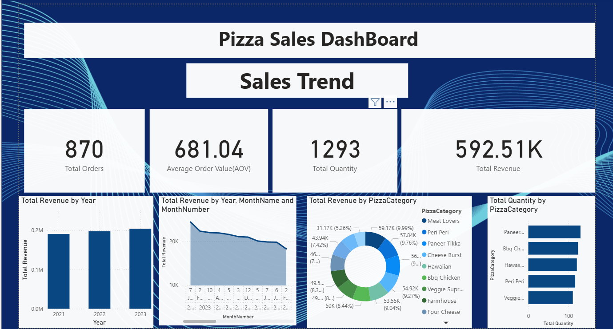
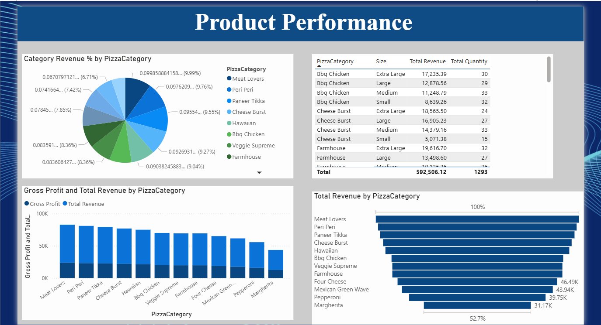
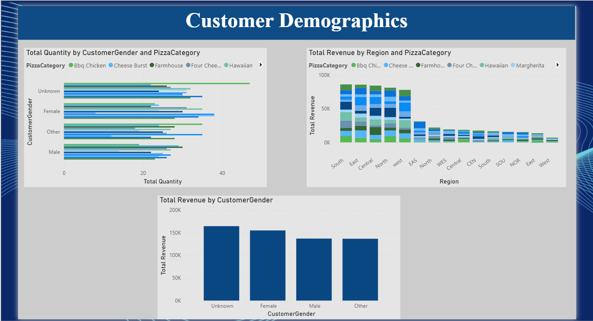
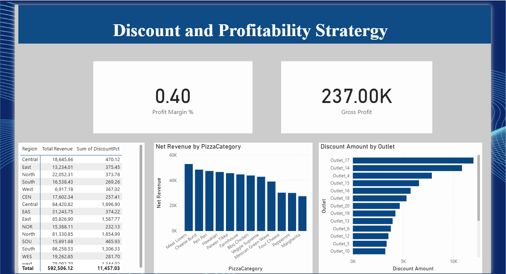
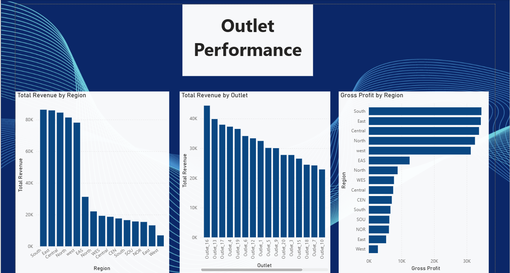

# 🍕 Pizza Sales Performance Dashboard

> Transforming raw sales data into actionable business insights using Power BI    

---

## 🚀 Project Overview

This project presents an interactive Power BI dashboard developed to analyze pizza sales data and uncover meaningful business insights. It focuses on identifying revenue trends, customer behavior, and product performance to support data-driven decision-making.

The dashboard provides a clear and intuitive view of business performance through KPIs, trends, and category-level analysis, enabling users to quickly interpret and act on insights.

---

## 🎯 Key Highlights

✨ End-to-end data analysis and visualization
📊 KPI tracking: Revenue, Orders, Quantity & Average Order Value
📅 Time-based sales trend analysis
🍕 Product and category performance insights
🎛️ Interactive dashboard for better exploration

---

## 📷 Dashboard Screens  

### 📊 Overview Dashboard  


### 🍕 Product Performance  


### 👥 Customer Demographics  


### 💰 Discount & Profitability Analysis  


### 🏪 Outlet Performance  

---

## 📈 Business Insights

* 📌 Sales peak during weekends and evening hours
* 📌 A few top-performing pizzas contribute major revenue
* 📌 Customer demand varies significantly across time
* 📌 Category-level analysis helps optimize product strategy

---

## 🛠️ Tech Stack

* **Power BI** → Dashboard Development
* **Data Analysis** → Insight Extraction
* **Data Visualization** → Interactive Charts & KPIs

---

## 🧹 Data Cleaning

Data preprocessing and cleaning were performed using Power BI Power Query Editor, including:

* Handling missing values
* Data transformation and formatting
* Filtering and structuring data for analysis

---

## 📂 Project Structure

```
pizza-sales-dashboard-powerbi/
│── pizza-sales-dashboard.pbix
│── data/
│     └── pizza_sales_raw.csv
│── images/
│     ├── dashboard-overview.png
│     ├── product-performance.png
│     ├── customer-demographics.png
│     ├── discount-profit-analysis.png
│     └── outlet-performance.png
│── README.md
```

---

## ▶️ Getting Started

1. Download the `.pbix` file
2. Open it in Power BI Desktop
3. Explore the dashboard using filters and visuals

---

## 💡 Why This Project Matters

This project demonstrates the ability to:

* Convert raw data into meaningful insights
* Design intuitive and interactive dashboards
* Apply data-driven thinking to solve business problems

---

## 🚀 Future Enhancements

* Add advanced filters and slicers
* Improve UI/UX with modern dashboard design
* Integrate real-time data sources

---

## 💬 Let’s Connect

If you have suggestions or feedback, feel free to connect. Always open to learning and improving 🚀


